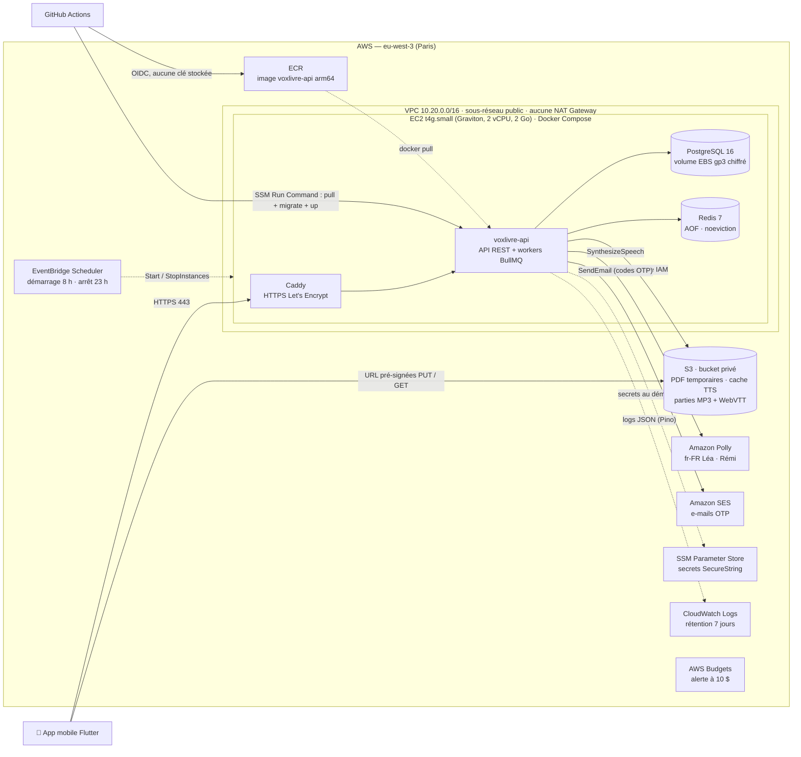
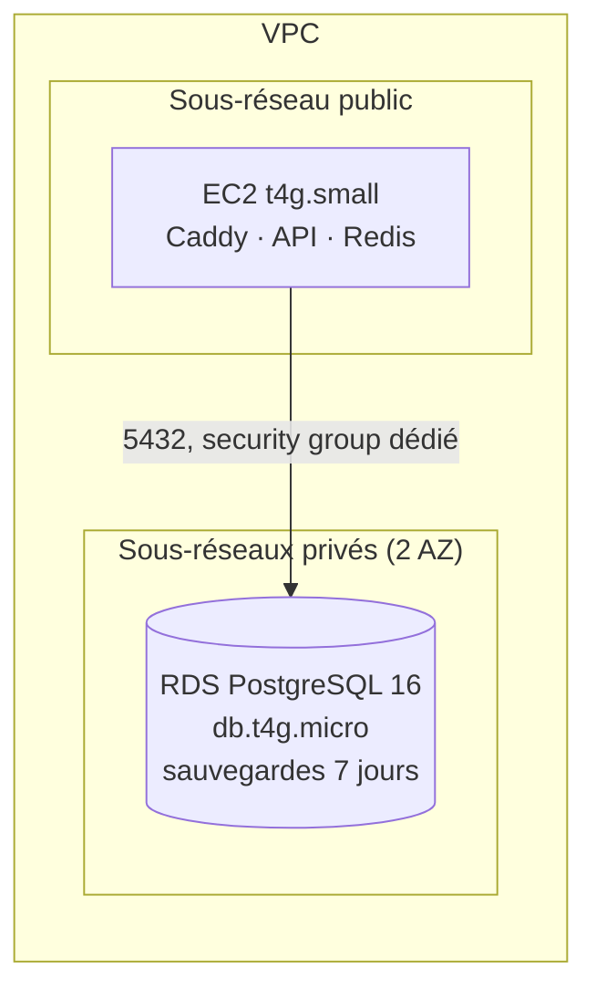
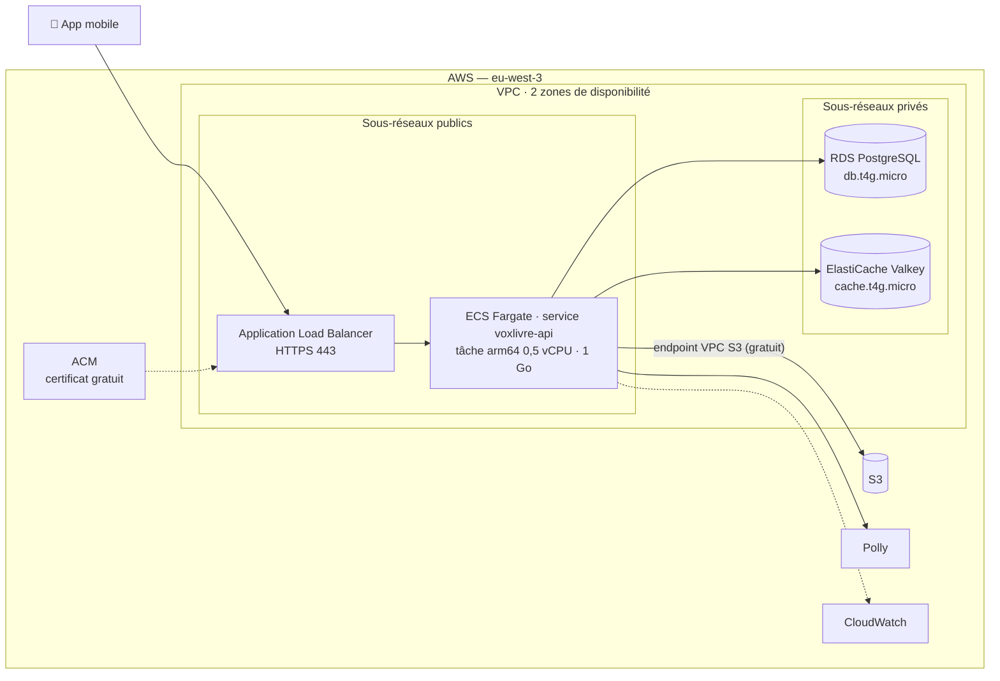

# Architecture AWS — voxlivre-api

Décision et justification : [ADR-0012](../adr/0012-aws-hosting-ec2-then-fargate.md).
Région : **eu-west-3 (Paris)**. Toute l'infrastructure est décrite en
Terraform (`infra/`, à venir). Prix publics us-east-1 relevés en
octobre 2026 ; **Paris coûte environ 10 à 15 % de plus**. Ils sont payés par
les crédits du compte (200 $ jusqu'au 2 avril 2027).

**Nom de domaine** : sous-domaine gratuit **DuckDNS** (`<nom>.duckdns.org`),
mis à jour au démarrage de l'instance (pas d'Elastic IP payante) ; Caddy en
obtient le certificat HTTPS auprès de Let's Encrypt.

## Phase 1 — une instance EC2, Docker Compose (environnement principal)

**Ce que montre ce schéma** : un seul point d'entrée HTTPS ; aucune clé
AWS dans l'application (rôle d'instance) ni dans GitHub (OIDC) ; le
téléchargement de l'audio ne passe jamais par l'API (URL pré-signées S3) ;
la machine s'éteint quand personne ne s'en sert.

## Phase 2 — base de données gérée

Même image, seule `DATABASE_URL` change (ADR-0003).

## Phase 3 — vitrine ECS Fargate (créée pour une démo, puis détruite)

`terraform apply` le matin d'une démo, `terraform destroy` le soir.

## Coûts mensuels

### Phase 1 — EC2 + Docker Compose

Tarifs eu-west-3 relevés le 2026-10-09 (API Pricing). Horaire appliqué
(`infra/envs/main`, module `ops`) : **8 h → 23 h tous les jours**, heure de
Douala, soit ~456 h/mois.

| Poste                                                  | Prix unitaire     | 24 h/24    | Allumée ~456 h/mois |
| ------------------------------------------------------ | ----------------- | ---------- | ------------------- |
| EC2 t4g.small (crédits CPU `standard`)                 | 0,0188 $/h        | 13,72 $    | 8,57 $              |
| IPv4 publique (automatique, libérée à l'arrêt)         | 0,005 $/h         | 3,65 $     | 2,28 $              |
| EBS gp3 20 Go système + 10 Go données (même éteinte)   | 0,0928 $/Go-mois  | 2,78 $     | 2,78 $              |
| Snapshots du volume de données (7 jours, incrémentaux) | 0,05 $/Go-mois    | < 0,50 $   | < 0,50 $            |
| S3 (quelques Go + requêtes)                            | 0,023 $/Go-mois   | < 0,50 $   | < 0,50 $            |
| ECR (une dizaine d'images)                             | 0,10 $/Go-mois    | ~0,10 $    | ~0,10 $             |
| CloudWatch Logs (7 j), SSM, Scheduler, Budgets, DLM    | quotas gratuits   | ~0 $       | ~0 $                |
| Sortie Internet (100 Go/mois offerts)                  | 0,09 $/Go au-delà | 0 $        | 0 $                 |
| **Total**                                              |                   | **≈ 21 $** | **≈ 14,50 $**       |

La première estimation (~6 $, ADR-0012) supposait 8 h par jour ouvré et
oubliait l'IPv4 et une partie du stockage : le budget AWS est passé de 10 à
**20 $/mois** (étape 3b) pour rester une alerte utile.

### Phase 2 — ajout de RDS

| Poste                                               | Prix unitaire   | 24 h/24    |
| --------------------------------------------------- | --------------- | ---------- |
| RDS db.t4g.micro (mono-AZ)                          | ~0,016 $/h      | ~11,70 $   |
| Stockage gp3 20 Go + sauvegardes (≤ 20 Go gratuits) | 0,115 $/Go-mois | ~2,30 $    |
| **Supplément**                                      |                 | **≈ 14 $** |

Une instance RDS arrêtée redémarre seule au bout de 7 jours : la supprimer
(avec snapshot final) quand la phase 2 n'est plus utile.

### Phase 3 — vitrine Fargate

| Poste                              | Prix unitaire                     | 24 h/24         | Par jour de démo |
| ---------------------------------- | --------------------------------- | --------------- | ---------------- |
| Fargate arm64 : 0,5 vCPU + 1 Go    | 0,03238 $/vCPU-h + 0,00356 $/Go-h | 14,40 $         | 0,47 $           |
| IPv4 publique de la tâche          | 0,005 $/h                         | 3,65 $          | 0,12 $           |
| ALB : heure + LCU + 2 IPv4         | 0,0225 $/h + …                    | ~24 $           | ~0,80 $          |
| RDS db.t4g.micro + stockage        |                                   | ~14 $           | ~0,45 $          |
| ElastiCache Valkey cache.t4g.micro | ~0,0128 $/h                       | ~9 $            | ~0,30 $          |
| **Total**                          |                                   | **≈ 62 à 65 $** | **≈ 2 $**        |

### Synthèse vocale (Polly)

| Voix                       | Prix (audio + horodatage) | Livre de 200 pages (~450 000 car.) | Livre de 300 pages (~885 000 car.) |
| -------------------------- | ------------------------- | ---------------------------------- | ---------------------------------- |
| Standard (Céline, Mathieu) | 2 × 4 $ / M car.          | ~3,60 $                            | ~7 $                               |
| Neuronale (Léa, Rémi)      | 2 × 16 $ / M car.         | ~14,40 $                           | ~28 $                              |

L'horodatage des mots (_Speech Marks_) est une **seconde requête**, facturée
comme l'audio — confirmé à l'essai réel (ADR-0013) ; les balises SSML ne sont
pas facturées. Le cache par empreinte (RNF-26) évite de repayer les relances
et les livres identiques. Audio Polly : 48 kbit/s, soit ~21,6 Mo par heure
(un livre de 200 pages ≈ 6 h 40, ≈ 145 Mo).

### Budget sur la durée des crédits (6 mois)

| Usage                          | Estimation                            |
| ------------------------------ | ------------------------------------- |
| Phase 1, 6 mois (8 h → 23 h)   | ~87 $ (~127 $ en continu)             |
| Phase 2, 2 mois                | ~28 $                                 |
| Vitrine Fargate, ~20 jours     | ~40 $                                 |
| Essais Polly (quelques livres) | ~10 à 30 $                            |
| **Total**                      | **~165 à 185 $** sur 200 $ de crédits |

## Pièges qui coûtent cher (et la parade)

| Piège                              | Coût                                        | Parade                                                                            |
| ---------------------------------- | ------------------------------------------- | --------------------------------------------------------------------------------- |
| NAT Gateway                        | ~32 $/mois + trafic                         | Sous-réseaux publics + security groups stricts ; endpoint VPC S3 gratuit          |
| Elastic IP réservée                | 3,65 $/mois, même instance éteinte          | IP automatique + DNS mis à jour au démarrage                                      |
| RDS « arrêtée »                    | Redémarre après 7 jours                     | Supprimer avec snapshot final                                                     |
| Logs sans rétention                | Croissance infinie                          | Rétention 7 jours sur chaque groupe                                               |
| ALB / ElastiCache oubliés          | ~33 $/mois                                  | Vitrine en Terraform, `destroy` systématique                                      |
| Ressources des activités Free plan | Consomment les crédits                      | Supprimer dès l'activité validée                                                  |
| SES en bac à sable                 | E-mails OTP refusés hors adresses vérifiées | Demander l'accès production + domaine vérifié (DKIM) avant les vrais utilisateurs |
| Compte root au quotidien           | Risque de compromission                     | MFA + utilisateur IAM, rôles à privilèges minimaux                                |

## Sécurité

- Bucket S3 : accès public bloqué, chiffrement SSE-S3, HTTP refusé
  (politique `aws:SecureTransport`), PDF sous `documents/` expirés à 3 jours
  (filet de sécurité derrière la purge applicative). Pas de CORS : l'app
  Flutter est native, CORS ne concerne que les navigateurs.
- État Terraform : bucket dédié versionné, chiffré, HTTPS seul, verrou natif
  S3 (`use_lockfile`), jamais dans Git (`infra/README.md`).
- Security group de l'instance : 443 (et 80 pour le défi Let's Encrypt)
  depuis Internet ; **pas de SSH ouvert** (administration par SSM Session
  Manager).
- Rôle d'instance limité au bucket du projet, à `polly:SynthesizeSpeech`,
  à `ses:SendEmail` sur l'identité expéditrice (ADR-0014),
  aux paramètres SSM `/voxlivre/*`, à la lecture ECR et à l'écriture des
  logs.
- GitHub Actions : rôle assumé par OIDC, limité au dépôt et à la branche
  `master`.
